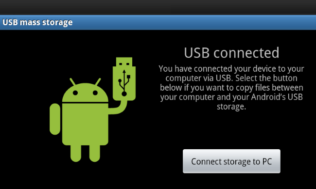

android的存储分为内部存储(internal)和外部存储(external)。内部存储就是我们熟知的`/data/data`, 这部分
存储仅限于当前应用(用户)访问，其他应用(用户)无法访问。外部存储就是我们熟知的`sdcard`，也是我们这里要
说的重点。

<!--more-->

在早期的设备中，内部存储和外部存储是硬件设备。因为存储器件价格昂贵，所以厂商的内部存储一般都比较小（我的
第一台手机是htc desire Z，它的内部存储才1.5G), 为了存储一些大的文件，比如照片、视频，就需要外部扩展sdcard。
这时候的`sdcard`就是真的物理设备上的sdcard。

> 早期外置的sdcard卡一般都是FAT系列的文件系统，比如FAT32。所有的应用都是可以自由访问的，在1.5之后，要访问就需要
申请`WRITE_EXTERANL_STORAGE`权限。
 
后面随着存储原器件的价格降低，厂商开始将内部存储划出一个分区，作为`外部存储区`，并逐渐不再支持扩展的物理sdcard。为了兼容性，这块分区仍然命名为`sdcard`。这块分区也是我们熟知的`/storage/self/primary`，`sdcard`文件夹使用symlink，链接到prmiary目录。
在支持物理sdcard的设备上，物理sdcard的叫`/storage/self/secondary`

> Galaxy Nexus 2应该是第一款不支持外置存储的手机，ROM的大小也之后16G。
 
在2.3的时候，android引入[`FUSE`](https://android.googlesource.com/kernel/common/+/bcmdhd-3.10/Documentation/filesystems/fuse.txt)，用于`Emulation`在存储设备上一个文件系统。最主要的功能是在一个在一个有权限控制的文件系统上（比如ext4）上模拟一个权限控制较弱的文件系统（比如FAT），以便应用间分享数据（应用间文件分享是android系统一个重要的功能）

> 在2.x的时代，要在PC上访问`sdcard`上的文件，需要将这个分区/设备挂载到PC上，这样会造成应用无法正常访问里面的文件。

 
在Android 3.1中，系统引入了` introduction of the Media Transfer Protocol`简称`MTP`。`MTP`提供了一个访问协议，由`MediaStorage`提供Provider给`MTP`，在`MTP`接收到访问指令的时候，向它提供文件列表/文件内容等数据。这样的话，连接到PC的手机就不会再将`sdcard`挂载到PC上了
 
Android 4.0是一个划时代的版本，从这个版本开始，OEM厂商开始大规模的不支持外置sdcard，并将`/data/media`文件夹"mount"成`sdcard`，也就是`primary external storage`.
 
Android 4.3开始，init、vold 和 recovery 所使用的各种 fstab 文件在 /fstab.<device> 文件中进行统一
> 这部分配置项的变更可以查看官方的[存储/设备配置](https://source.android.com/devices/storage/config#file_mappings)说明
 
从Android 4.4开始，系统开始增加应用在扩展存储中的沙盒机制，允许应用在没有授权的情况下读取应用的沙盒文件(在`/Android/{data,meida,obb}/{PackageName}`目录下)。并且在这个版本，系统引入了[`存储访问框架`](https://developer.android.com/guide/topics/providers/document-provider)，用于有需要的应用可以浏览和打开各种文档、图片及其他文件，而不用管这些文件来自其首选文档存储提供程序中的哪一个。存储访问框架（Storage Access Framework, 简称SAF）在7.0的版本上增加了分区存储(scoped stroage)的特性, android 10后增强了这个特性(以android 10为目标版本的应用将无法访问扩展存储，除非在AndroidManifest.xml中声明了requestLegacyExternalStorage), 在android 11中系统设置会忽略这个整个声明。

